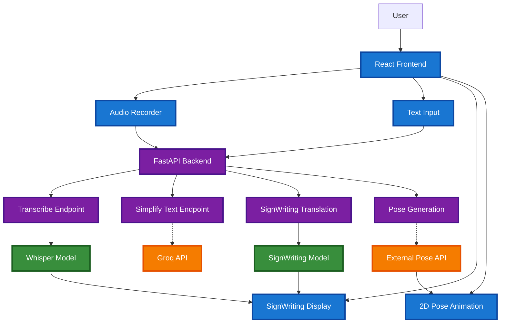

# SignCast

Real-time voice-to-sign language translator powered by AI

## What is SignCast?

SignCast translates spoken English into **SignWriting notation** and **animated sign language** in real-time. Built for accessibility, it helps Deaf and hard-of-hearing users access spoken content anywhere.

### Key Features

- **Real-time Speech Recognition** - Powered by OpenAI Whisper (local processing)
- **Text Simplification** - Optional AI-powered text simplification (requires internet)
- **SignWriting Translation** - Converts text to visual sign notation (local processing)
- **Sign Animation** - 2D pose-based sign language animation
- **Export Options** - Download SignWriting as images
- **Local Processing** - Core AI models run on your device

## How It Works

```
Speech Input → Text → SignWriting → Animation
```

1. **Capture** audio from microphone or system
2. **Transcribe** speech to text using Whisper AI
3. **Simplify** text for better translation (optional)
4. **Translate** to SignWriting notation
5. **Animate** with 2D pose visualization

## Architecture



SignCast uses **local AI processing** with optional online enhancements:

- **Local Processing** - Speech recognition and SignWriting translation run on your device
- **Optional Online** - Text simplification via Groq API (can be disabled)
- **Privacy-Focused** - Core AI models don't send data to external servers

## Tech Stack

| Category       | Technology              | Purpose             |
| -------------- | ----------------------- | ------------------- |
| **Frontend**   | React + TypeScript      | UI Framework        |
|                | Vite                    | High-Speed Build Tool |
|                | Tailwind CSS            | Modern Styling      |
|                | @sutton-signwriting     | SignWriting Engine  |
|                | Pose Viewer             | 2D Visualization    |
| **Backend**    | FastAPI                 | High-Perf API       |
|                | PyTorch                 | ML Framework        |
|                | Sockeye                 | Neural Translation  |
| **AI/ML**      | SignWriting Model       | Text-to-Sign NMT    |
|                | OpenAI Whisper          | Speech Recognition  |
|                | Groq API                | Fast Inference      |


## Quick Start

### Run Locally

```bash
# Clone the repository
git clone https://github.com/your-org/SignCast.git
cd SignCast

# Quick start (Windows)
.\scripts\start_app.ps1

# Quick start (Linux/Mac)
./scripts/start_app.sh

# Open http://localhost:5173
```

### Development Setup

See [CONTRIBUTING.md](CONTRIBUTING.md) for detailed development setup instructions.

## Use Cases

- **Live Meetings** - Real-time translation of spoken content
- **Video Content** - Translate audio from videos and media
- **Education** - Learning tool for sign language
- **Accessibility** - Making spoken content accessible to Deaf users

## Contributing

We welcome contributions! Please see [CONTRIBUTING.md](CONTRIBUTING.md) for development setup and guidelines.

## Roadmap

- More Languages - Support for additional spoken languages
- Improved Models - Better SignWriting translation accuracy
- Real-time Collaboration - Multi-user sessions
- Offline Pose Generation - Remove dependency on external pose API

## License

MIT License - see [LICENSE](LICENSE) for details.

## Acknowledgments

- [OpenAI Whisper](https://github.com/openai/whisper) - Speech recognition
- [SignWriting Translation](https://github.com/sign-language-processing/signwriting-translation) - ML model
- [Sutton SignWriting](https://www.signwriting.org/) - SignWriting notation system
- [Pose Viewer](https://github.com/sign-language-processing/pose-viewer) - 2D pose visualization

---

<div align="center">
  <strong>Made with care for accessibility and inclusion</strong>
</div>
